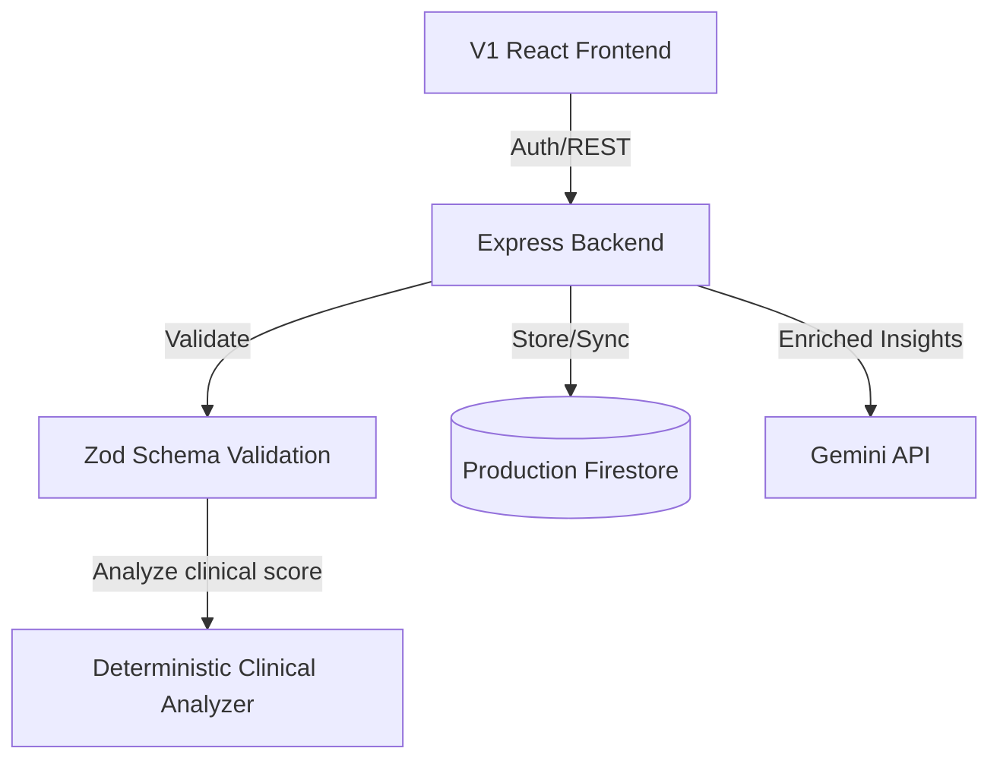

# HealthGuard AI V1 Architecture

This document details the stable production architecture of the HealthGuard AI V1 MVP platform.

## 1. High-Level Flow

## 2. Core V1 Services

1. **Risk Assessment Engine**:
   - Deterministic, clinical-based risk calculator (FINDRISC for Diabetes, Framingham for Cardiovascular Disease and Hypertension).
   - Generates immediate, safe, deterministic prevention advice locally or on the backend.

2. **AI Advice Service**:
   - Enriches deterministic clinical results using the Gemini API.
   - Generates personalized diet, exercise, and rationale logs based on age, gender, biometrics, smoking, symptoms, and family history.

3. **Local-First Synchronization**:
   - Frontend stores profiles and results in LocalStorage (`hg.profile.v1`, `hg.result.v1`).
   - Syncs profile data to Firestore when connection is available and auth is configured.

## 3. Database Collection Schema

- **profiles**: Stores user biometric profile data, language preferences, and the calculated `result` block.
- **assessments**: Record of calculated clinical risks for auditing and reporting.
- **progress**: Weight and BMI milestones.
- **progressLogs**: Historical progress snapshot of each assessment completed.
