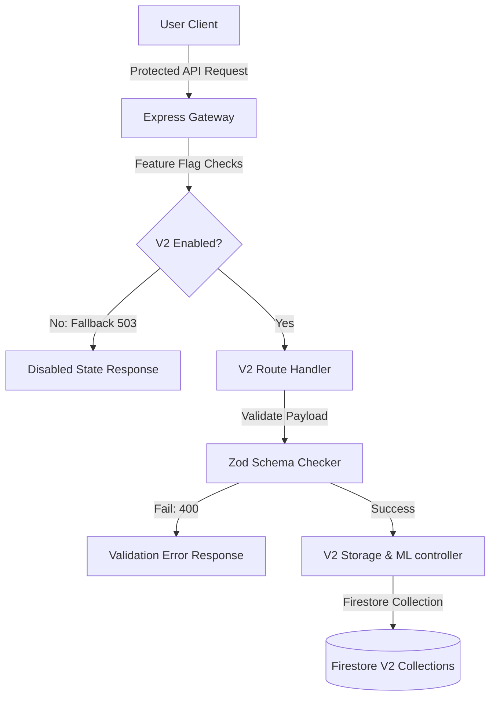

# Architecture Design: HealthGuard AI V2

This document details the architecture design for the V2 upgrade of the HealthGuard AI preventive health engine, integrating machine learning models, laboratory report processing, personalized recommendations, and localized context engines.

## 1. Feature Flags & Decoupled Isolation

All new health-intelligence integrations reside behind distinct feature flags to ensure additive safety without breaking legacy stability:

- **Frontend Toggle**: `VITE_ENABLE_HEALTH_ENGINE_V2` (defaults to `false`).
- **Backend Toggle**: `HEALTH_ENGINE_V2_ENABLED` (defaults to `false`).

When disabled, all endpoints under the versioned route path `/api/v2/*` yield a controlled `HEALTH_ENGINE_V2_DISABLED` response (HTTP 503 Service Unavailable).

## 2. Versioned Endpoint Separation

To avoid collision with the active database synchronization and calculations, all V2 interfaces are completely isolated on their own version path `/api/v2/*`.

The four core endpoints introduced in Phase 1:

1. **Health Assessment**: `/api/v2/health-assessment` (GET / POST)
2. **Lab Reports**: `/api/v2/lab-reports` (GET / POST)
3. **Recommendations**: `/api/v2/recommendations` (GET / POST)
4. **Regional Context**: `/api/v2/regional-context` (GET / POST)

## 3. Fallback and Resilience Strategy

- **Fallback Database**: V2 schemas are mapped to dedicated Firestore collections (`assessmentsV2`, `labReportsV2`, `recommendationsV2`, `regionalContextV2`). The primary risk models and local structures from V1 are retained as-is, ensuring that if a V2 ML module encounters an error, the platform remains fully functional.
- **Fail-Soft Logic**: In case of failures, client components display a user-friendly unavailable message instead of crashing the UI, allowing normal navigation and dashboard viewing.
