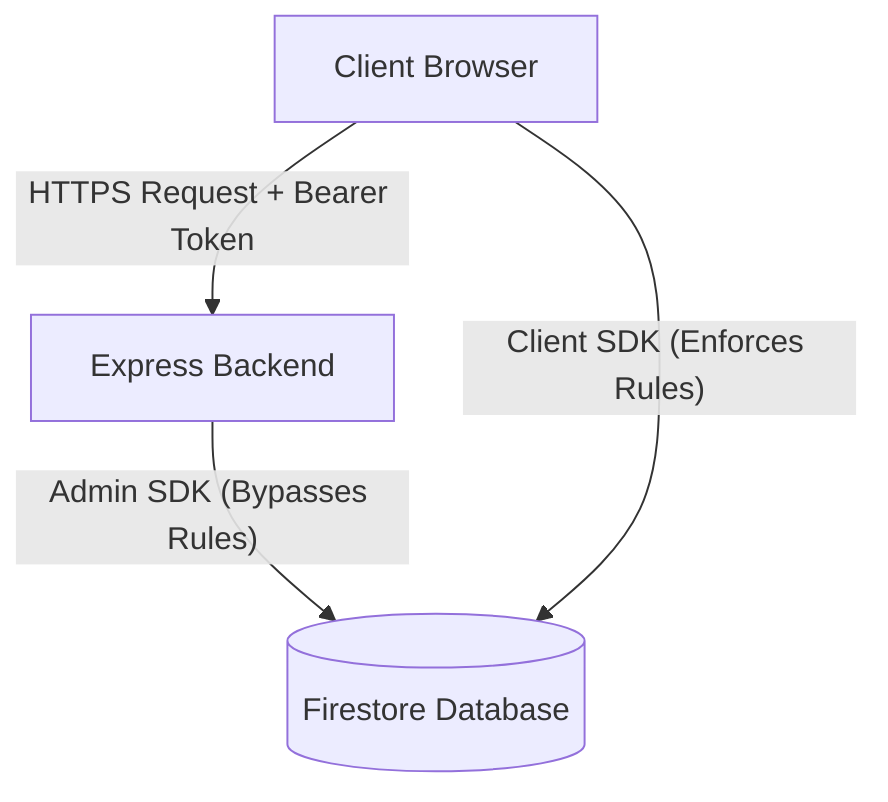

# Security Model & Threat Assessment

This document outlines the security architecture, trust boundaries, token verification pipelines, and access control models for HealthGuard AI.

## 1. Trust Boundaries

The application is structured into three primary environments:

- **Client (Browser)**: Runs the React frontend. Untrusted. Any LocalStorage cached content or memory state can be manipulated by the end-user.
- **Node/Express Backend API**: Receives HTTP requests. Fully trusted. Validates authentication tokens, enforces resource authorization, and communicates with Firestore.
- **Firestore Database**: Stores patient profiles, assessment records, progress logs, and expert reviews. Fully trusted.

---

## 2. Authentication Source of Truth

- Authentication is enforced globally using Firebase ID tokens passed in the `Authorization: Bearer <Token>` header.
- The **UID is derived exclusively on the server side** after verifying the signature, expiration, and audience of the ID token using the Firebase Admin SDK.
- The application rejects client-provided UIDs (`req.body.uid`, `req.body.userId`, or query params) for authentication or authorization decisions.
- **Mock Authentication Gating**: To support local validation, mock authentication is strictly gated. It is only permitted when:
  1. `NODE_ENV` is set to `development` or `test`.
  2. `ENABLE_MOCK_AUTH` is set to `"true"`.
     Mock authentication is disabled by default in all environments and will immediately fail in production.

---

## 3. Data Access & Cross-User Isolation

To guarantee patient data privacy, the system implements multi-layered isolation:

### Backend Resource Authorization

Every protected route handler inside the Express backend enforces that resource queries are scoped strictly to the authenticated `uid`:

- Profile retrieves and writes: `db.collection("profiles").doc(uid)`
- Progress logs query: `db.collection("progressLogs").where("userId", "==", uid)`

### Scoped LocalStorage

On the client side, LocalStorage keys are dynamically namespaced by the active user's UID to prevent cross-user leakage (e.g., when a user logs out and another logs in on the same browser):

- Keys are formatted as `hg.<base_key>.v1:<uid>`
- If no user is authenticated, guest data is isolated under `hg.<base_key>.v1:guest`
- Legacy unsuffixed keys (e.g., `hg.profile.v1`) are safely migrated on auth state resolution or quarantined to `quarantine.<key>` if ownership is absent.

### Expert Review & Messages Authorization

- Ordinaries cannot self-promote to `verified: true` experts. Gated behind `ENABLE_MOCK_EXPERT_SIGNUP=true` and `NODE_ENV=test/development`.
- Request and message access is locked down. A request's messages can only be retrieved or created by:
  - The patient owner who created the request.
  - The assigned verified expert.
- Message sender role derivation is handled server-side. The client cannot forge `senderRole`.

---

## 4. Firestore Security Rules

To protect direct database connections from the client SDK (such as message polling and feedback forms), the Firestore security rules enforce:

- **Default Deny**: All collections block read/write access by default unless explicitly allowed.
- **User Scoping**: Users can only read/write documents in `users` and `profiles` where the document ID matches their authenticated UID.
- **Expert Gating**: Client modifications to the `experts` collection cannot alter or set `verified` status to true.
- **Message Integrity**: Read/write on `expertMessages` is restricted to the owning patient or the assigned verified expert using resource lookups. Client-provided `senderRole` must match their actual identity.
